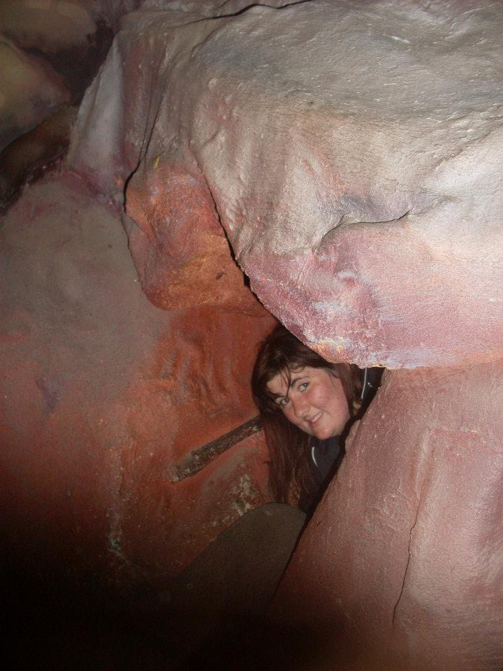
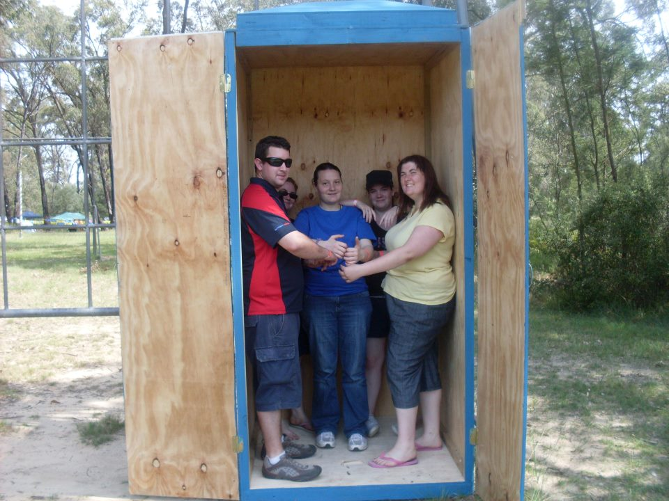
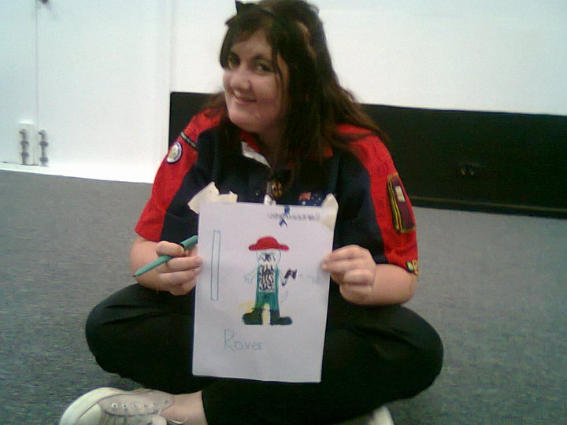
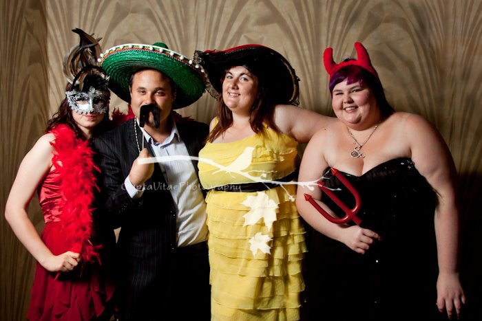
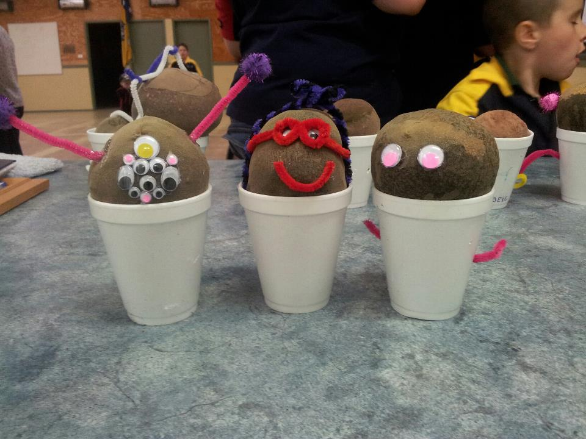
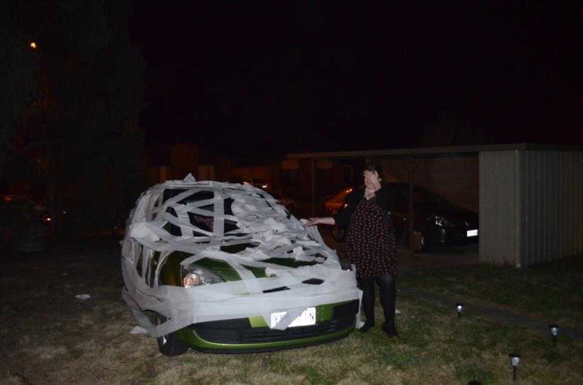
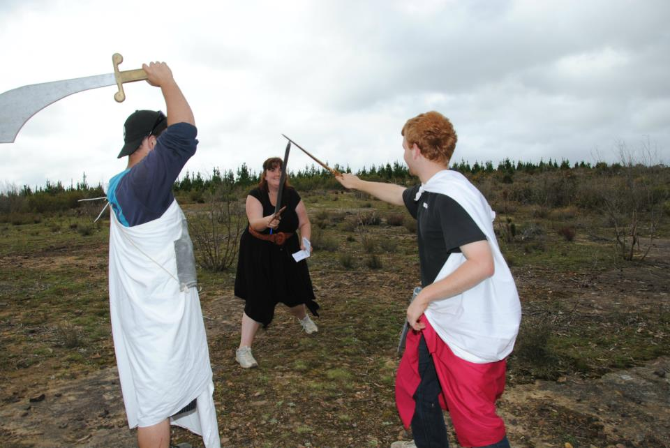
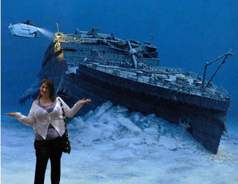
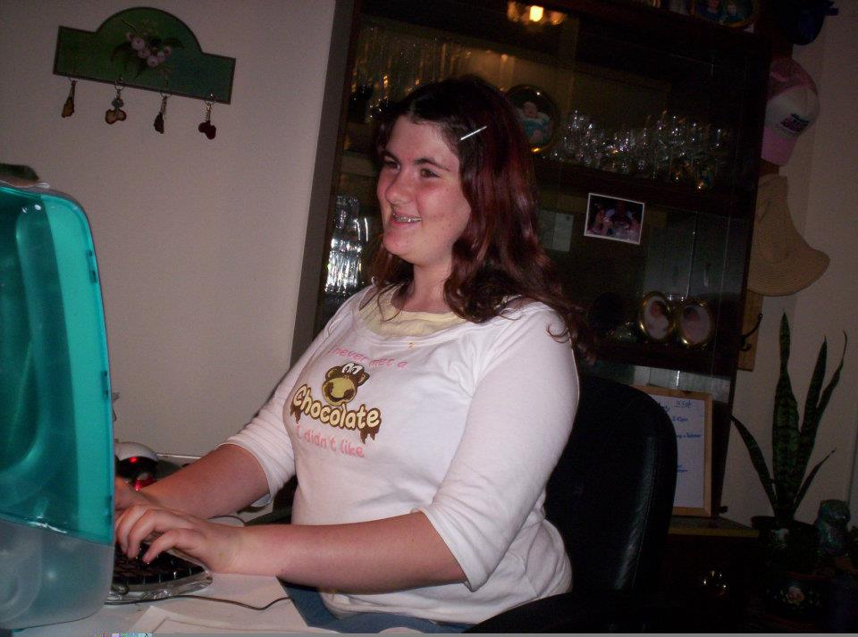
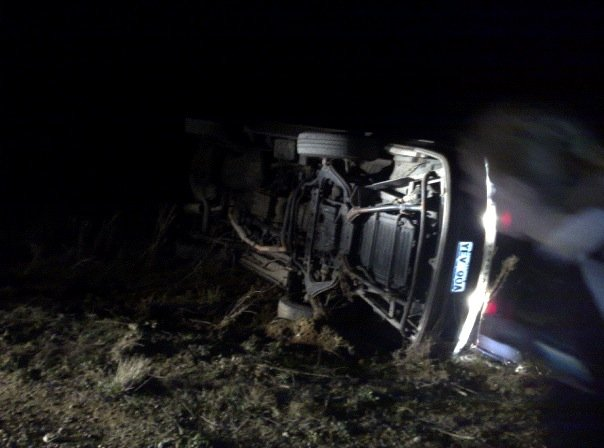

Story
=====

Once upon a time there was a Bronwyn, born of the Robbon people.  She was born and raised inside a cave:

And from there she graduated to wooden boxen:

She went to school:

But then she fell into the wrong crowd, particularly the well known bandit El Boundo:

And the dreaded potato head gang:

Who engaged in criminal activities for money:

And extorted money from innocent Americans and sometimes Hannah:

She needed to get away from her terrible life of crime! She had to fight!

Bron only managed to get away once they all suffered a terrible accident after she killed them:

And she had to lie low somewhere obscure for a while:

But she was still occasionally spotted in odd places:

She now works as a blogger for a major Internet conspiracy theory site

THE END

